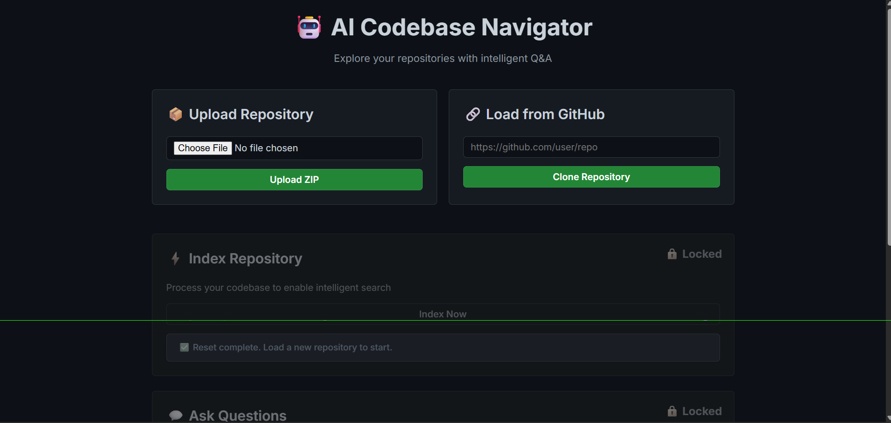
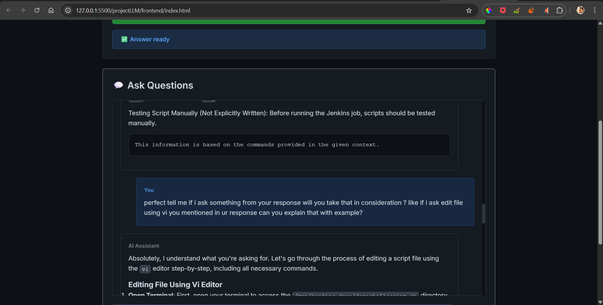

# AI Codebase Navigator

A powerful AI-powered tool to navigate and query your codebase using RAG (Retrieval-Augmented Generation). It uses a local LLM via Ollama to ensure your code stays private.

## 📋 Prerequisites

Before you begin, ensure you have the following installed:

1.  **Python 3.8+**: [Download Python](https://www.python.org/downloads/)
2.  **Ollama**: [Download Ollama](https://ollama.com/)
3.  **Git**: [Download Git](https://git-scm.com/)

### Required AI Models

You need to pull the embedding and chat models in Ollama:

```bash
ollama pull nomic-embed-text
ollama pull qwen2.5:3b-instruct 
or 
ollama pull qwen3:4b
```

## 🚀 Installation & Setup

### 1. Backend Setup

Navigate to the backend directory and set up the Python environment.

```bash
cd backend

# Create virtual environment (optional but recommended)
python -m venv venv

# Activate virtual environment
# Windows:
venv\Scripts\activate
# Mac/Linux:
# source venv/bin/activate

# Install dependencies
pip install -r requirements.txt
```

### 2. Frontend Setup

The frontend is a standalone HTML file. No installation is required. You can simply open `frontend/index.html` in your browser.

However, for the best experience (and to avoid CORS issues in some browsers), it's recommended to serve it with a simple server or use VS Code's "Live Server" extension.

## 🏃 Running the Application

### 1. Start the Backend Server

Ensuring your virtual environment is activated:

```bash
cd backend
uvicorn app:app --reload
```
*   The API will run at `http://127.0.0.1:8000`
*   You will see output indicating the server is running (`Uvicorn running on ...`).

### 2. Launch the Frontend

Open `frontend/index.html` in your web browser.

## 💡 Usage Workflow

1.  **Upload Repository**:
    *   Click **"Choose File"** and upload a ZIP file of your code.
    *   OR enter a **GitHub URL** and click "Clone Repository".
    *   *Wait for the notification confirming the upload/clone.*
2.  **Index Repository**:
    *   Once uploaded, the **"Index Repository"** section will unlock.
    *   Click **"Index Now"**.
    *   *This processes your code into vector embeddings.*
3.  **Ask Questions**:
    *   After indexing is complete, the **Chat** section unlocks.
    *   Type your question (e.g., "How does the login work?", "Explain the main logic in app.py").
    *   The AI will answer with context from your specific codebase.

## 📂 Project Structure

```
projectLLM/
├── backend/
│   ├── app.py              # Main FastAPI application
│   ├── requirements.txt    # Python dependencies
│   ├── start.bat           # Quick start script for Windows
│   └── rag/
│       ├── indexer.py      # Logic for chunking and indexing code
│       ├── query.py        # Logic for RAG querying and LLM interaction
│       └── scaledown.py    # Context compression utility
└── frontend/
    └── index.html          # Main UI (Single file app)
```

## 🖼️ Outputs

When running successfully, you should see:

*   **Terminal**: Uvicorn logs showing requests `POST /upload-repo`, `POST /index-repo`, `POST /ask`.
*   **Browser**: A dark-themed UI (GitHub style) with:
    *   Top section for Uploading/Cloning.
    *   Middle section for Indexing (locked initially).
    *   Bottom Chat interface (locked until indexed).





## ⚠️ Common Issues

*   **"Backend not reachable"**: Ensure `uvicorn` is running on port 8000.
*   **"Ollama connection failed"**: Ensure Ollama is running (`ollama serve`).
*   **Model not found**: Run the `ollama pull` commands listed in Prerequisites.
